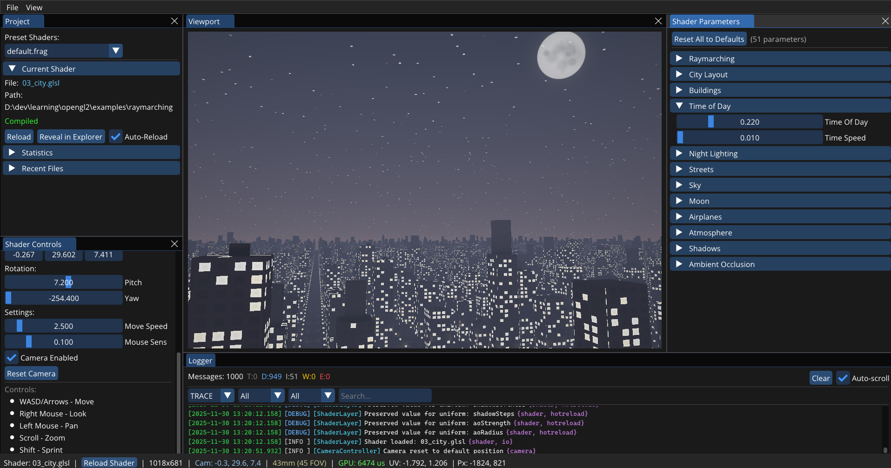

# Kiwi Shader

A modern OpenGL-based shader development environment with preprocessor enhancements and automatic UI generation. Built for rapid prototyping and experimentation with fragment shaders, implicit surfaces, and raymarching techniques.

**Repository**: [https://github.com/MustafaAlotbah/kiwi-shader](https://github.com/MustafaAlotbah/kiwi-shader)



## Overview

This framework extends standard GLSL with a preprocessor that adds include directives and an annotation system for automatic UI control generation. It provides a live-editing environment with hot-reload support, making shader development more efficient and organized.

The project was developed to address common challenges in shader development: managing complex codebases with shared utilities, and providing intuitive parameter controls without manual UI coding.

## Features

### Include System

Standard GLSL does not support `#include` directives, which makes code reuse and organization difficult. This framework implements a C-style preprocessor that resolves includes at shader load time.

**Why Include Support?**

Shader projects, especially those involving signed distance functions (SDFs) or raymarching, often share substantial amounts of common code. Without includes, developers must either duplicate code across files or manually concatenate utilities, making maintenance error-prone. The include system enables modular shader development with reusable libraries.

**Syntax:**

```glsl
#version 330 core

#include "common/noise.glsl"
#include "common/colors.glsl"
#include "common/sdf.glsl"

uniform float iTime;
uniform vec3 iResolution;

out vec4 fragColor;
in vec2 fragCoord;

void main() {
    vec2 uv = fragCoord;
    float noise = fbm(uv * 5.0 + iTime, 4);  // From noise.glsl
    vec3 color = viridis(noise);              // From colors.glsl
    fragColor = vec4(color, 1.0);
}
```

**Features:**
- Recursive include resolution with circular dependency detection
- Relative and absolute path support
- Dependency tracking for automatic shader hot-reloading
- Detailed error reporting with file and line information

See `assets/shaders/example_with_includes.frag` for a complete example.

### Annotation System

The annotation system allows developers to define UI controls directly in shader code using special comments, similar to Unity's shader property attributes. The framework automatically generates ImGui controls based on these annotations.

**Why Annotations?**

Creating manual UI code for each shader parameter is tedious and error-prone. When experimenting with shaders, you want immediate visual feedback as you adjust parameters. The annotation system eliminates boilerplate by automatically generating type-appropriate controls (sliders, color pickers, checkboxes) from simple comments.

**Supported Annotations:**

#### Sliders
```glsl
// @slider(min=0.1, max=5.0, default=0.8)
uniform float uSpeed;

// @slider(min=1, max=8, default=5)
uniform int uOctaves;
```

#### Color Pickers
```glsl
// @color(default=0.85,0.15,0.1)
uniform vec3 uSphereColor;

// @color(default=0.95,0.3,0.4,1.0)
uniform vec4 uColorWithAlpha;
```

#### Checkboxes
```glsl
// @checkbox(default=true)
uniform int uAnimated;

// @checkbox(default=false)
uniform int uEnableEffect;
```

#### Vector Controls
```glsl
// @vec2(default=0.5,0.5)
uniform vec2 uOffset;

// @vec3(default=1.0,0.0,0.0)
uniform vec3 uDirection;
```

**Example Shader:**

See `assets/shaders/annotated_demo.frag` for a complete demonstration of the annotation system, or `assets/shaders/raymarching.frag` for a complex raymarching scene with numerous configurable parameters.

### Complete Annotation Reference

| Annotation | GLSL Type | Parameters | Generated Control | Example |
|------------|-----------|------------|-------------------|---------|
| `@slider` | `float` | `min`, `max`, `default`, `step` (optional) | Float slider | `// @slider(min=0.0, max=1.0, default=0.5)`<br>`uniform float uValue;` |
| `@slider` | `int` | `min`, `max`, `default` | Integer slider | `// @slider(min=1, max=10, default=5)`<br>`uniform int uCount;` |
| `@color` | `vec3` | `default` (R,G,B values 0.0-1.0) | RGB color picker | `// @color(default=1.0,0.5,0.0)`<br>`uniform vec3 uTint;` |
| `@color` | `vec4` | `default` (R,G,B,A values 0.0-1.0) | RGBA color picker with alpha | `// @color(default=1.0,0.5,0.0,0.8)`<br>`uniform vec4 uTintAlpha;` |
| `@checkbox` | `int` | `default` (true/false) | Boolean checkbox | `// @checkbox(default=true)`<br>`uniform int uEnabled;` |
| `@vec2` | `vec2` | `default`, `min`, `max`, `step` (optional) | 2-component drag control | `// @vec2(default=0.5,0.5)`<br>`uniform vec2 uOffset;` |
| `@vec3` | `vec3` | `default`, `min`, `max`, `step` (optional) | 3-component drag control | `// @vec3(default=0.0,1.0,0.0)`<br>`uniform vec3 uDirection;` |
| `@vec4` | `vec4` | `default`, `min`, `max`, `step` (optional) | 4-component drag control | `// @vec4(default=1.0,1.0,1.0,1.0)`<br>`uniform vec4 uParams;` |

**Parameter Details:**

- **min, max**: Define the valid range for numeric values
- **default**: Initial value when shader is loaded
- **step**: Drag speed/increment for drag controls (default: 0.01)
- All numeric parameters support both integer and floating-point notation
- Color defaults use comma-separated RGB or RGBA values (range: 0.0 to 1.0)
- For vectors, default values are comma-separated without spaces

**Syntax Rules:**

1. Annotation comment must appear on the line immediately before the uniform declaration
2. Parameters are comma-separated key-value pairs: `key=value`
3. No spaces between array elements in default values
4. Annotation format: `// @type(param1=value1, param2=value2)`

### Built-in Uniforms

The framework automatically provides Shadertoy-compatible uniforms:

```glsl
uniform float iTime;         // Elapsed time in seconds
uniform float iTimeDelta;    // Frame delta time
uniform vec3 iResolution;    // Viewport resolution (width, height, aspect)
uniform vec4 iMouse;         // Mouse position and click state
```

### 3D Camera System

The framework includes an interactive 3D camera controller, perfect for exploring raymarched scenes. Camera uniforms are automatically provided to all shaders.

**Camera Uniforms:**

```glsl
uniform vec3 uCameraPosition;    // Camera world position
uniform vec3 uCameraForward;     // Normalized forward direction
uniform vec3 uCameraRight;       // Normalized right direction
uniform vec3 uCameraUp;          // Normalized up direction
uniform vec3 uCameraTarget;      // Look-at target (position + forward)
uniform mat4 uViewMatrix;        // View transformation matrix
uniform mat4 uProjectionMatrix;  // Projection matrix
uniform float uCameraFOV;        // Field of view in degrees
uniform float uCameraNear;       // Near clipping plane
uniform float uCameraFar;        // Far clipping plane
```

**Camera Controls:**

| Input | Action |
|-------|--------|
| **W / Up Arrow** | Move forward |
| **S / Down Arrow** | Move backward |
| **A / Left Arrow** | Strafe left |
| **D / Right Arrow** | Strafe right |
| **Q / Space** | Move up |
| **E / Ctrl** | Move down |
| **Right Mouse + Drag** | Look around (rotate camera) |
| **Left Mouse + Drag** | Pan camera |
| **Mouse Scroll** | Zoom (adjust FOV) |
| **Shift** | Sprint (2x movement speed) |

**Example: Raymarching with Camera**

```glsl
#version 330 core

uniform float iTime;
uniform vec3 iResolution;

// Camera uniforms (automatically provided)
uniform vec3 uCameraPosition;
uniform vec3 uCameraForward;
uniform vec3 uCameraRight;
uniform vec3 uCameraUp;

// Scene SDF
float sceneSDF(vec3 p) {
    float sphere = length(p - vec3(0.0, 1.0, 0.0)) - 1.0;
    float ground = p.y;
    return min(sphere, ground);
}

// Raymarching
float raymarch(vec3 ro, vec3 rd) {
    float t = 0.0;
    for (int i = 0; i < 100; i++) {
        vec3 p = ro + rd * t;
        float d = sceneSDF(p);
        if (d < 0.001) return t;
        if (t > 100.0) break;
        t += d;
    }
    return -1.0;
}

void main() {
    vec2 uv = gl_FragCoord.xy / iResolution.xy;
    vec2 ndc = uv * 2.0 - 1.0;
    ndc.x *= iResolution.x / iResolution.y;
    
    // Generate ray from camera
    vec3 ro = uCameraPosition;
    vec3 rd = normalize(
        uCameraForward + 
        ndc.x * uCameraRight * 0.8 + 
        ndc.y * uCameraUp * 0.8
    );
    
    // Raymarch and shade
    float t = raymarch(ro, rd);
    vec3 color = vec3(0.1, 0.1, 0.2); // Sky
    
    if (t > 0.0) {
        vec3 p = ro + rd * t;
        // Simple shading based on height
        color = mix(vec3(0.2, 0.5, 0.2), vec3(0.8, 0.3, 0.2), p.y);
    }
    
    gl_FragColor = vec4(color, 1.0);
}
```

See `assets/shaders/camera_demo.frag` for a complete interactive camera example.

### Shader Library

The `assets/shaders/common/` directory includes production-ready utilities:

- **noise.glsl**: Value noise, fractional Brownian motion (FBM), simplex noise approximation
- **colors.glsl**: RGB/HSV conversion, procedural color palettes (fire, rainbow, sunset, viridis), saturation/contrast adjustments
- **sdf.glsl**: 2D and 3D signed distance functions (sphere, box, torus, cylinder), boolean operations (union, subtraction, smooth blending)

## Getting Started

### Requirements

- **CMake** 3.26 or higher
- **C++20** compatible compiler (MSVC 2019+, GCC 10+, Clang 12+)
- **OpenGL** 3.3 or higher
- **Windows** (currently uses Windows-specific file dialogs; cross-platform support planned)

### Building

1. Clone the repository:
```bash
git clone https://github.com/MustafaAlotbah/kiwi-shader.git
cd kiwi-shader
```

2. Initialize and update git submodules (for dependencies):
```bash
git submodule update --init --recursive
```

3. Configure the project with CMake:
```powershell
./configure.ps1
```

4. Build and run:
```powershell
./build.ps1
```

The executable will be located at `build/Release/opengl_template.exe`.

### Alternative Build (Manual CMake)

```bash
# Configure
mkdir build
cd build
cmake ../source -DCMAKE_BUILD_TYPE=Release

# Build
cmake --build . --config Release

# Run
./Release/opengl_template.exe
```

### Usage

1. Launch the application
2. Use **File > Open Shader** to load a fragment shader (`.frag`, `.glsl`)
3. Edit shader parameters using the auto-generated UI in the **Properties** panel
4. Modify shaders externally; changes are detected and hot-reloaded automatically
5. Press **F11** for fullscreen mode

Try loading the example shaders:
- `assets/shaders/example_with_includes.frag` - Demonstrates the include system
- `assets/shaders/annotated_demo.frag` - Demonstrates annotation controls
- `assets/shaders/raymarching.frag` - Complex raymarched 3D scene
- `assets/shaders/camera_demo.frag` - Interactive 3D camera with raymarching

## Architecture

**Core Components:**

- **ShaderPreprocessor**: Handles `#include` directive resolution, dependency tracking, and circular include detection
- **UniformParser**: Extracts annotation comments and parses parameters using a custom lexer/parser
- **UniformEditor**: Generates ImGui controls and binds uniform values to OpenGL shader programs
- **ShaderLayer**: Manages shader lifecycle, hot-reloading, GPU timing, and file watching
- **CameraController**: Interactive 3D camera with FPS-style controls for scene exploration
- **StatusBar**: VSCode-style status bar with GPU timing, mouse coordinates, and camera position
- **AnnotationLexer/Parser**: Tokenizes and parses annotation syntax into structured data

## Examples

### Basic Animated Pattern

```glsl
#version 330 core

#include "common/noise.glsl"
#include "common/colors.glsl"

uniform float iTime;
uniform vec3 iResolution;

// @slider(min=1.0, max=10.0, default=5.0)
uniform float uScale;

// @slider(min=0.0, max=1.0, default=0.5)
uniform float uColorShift;

out vec4 fragColor;
in vec2 fragCoord;

void main() {
    vec2 uv = fragCoord * uScale;
    float n = fbm(uv + iTime * 0.2, 5);
    vec3 col = viridis(n + uColorShift);
    fragColor = vec4(col, 1.0);
}
```

### Raymarching Scene

See `assets/shaders/raymarching.frag` for a complete raymarching implementation with:
- Camera controls (position, pitch, yaw, FOV)
- Scene objects with materials
- Lighting and shadows
- Atmospheric fog
- Sky gradient with sun

## Technical Details

- **Language**: C++20
- **Graphics API**: OpenGL 3.3+ (Core Profile)
- **GUI**: Dear ImGui with GLFW backend
- **Math Library**: GLM (OpenGL Mathematics)
- **Build System**: CMake 3.26+

## Dependencies

All dependencies are included as git submodules or source:

- **GLFW**: Window management and input
- **GLAD**: OpenGL loader
- **GLM**: Mathematics library
- **Dear ImGui**: Immediate mode GUI
- **nlohmann/json**: Settings persistence
- **stb**: Image loading utilities

## Project Structure

```
.
├── assets/
│   ├── shaders/           # Example shaders
│   │   ├── common/        # Shared utility libraries
│   │   ├── example_with_includes.frag
│   │   ├── annotated_demo.frag
│   │   └── raymarching.frag
│   └── fonts/             # UI fonts
├── source/
│   ├── include/           # Header files
│   │   └── utility/       # Core framework utilities
│   ├── src/               # Implementation files
│   │   ├── main.cpp
│   │   └── utility/       # Framework implementation
│   └── dependency/        # Third-party libraries
├── build/                 # CMake build directory
├── configure.ps1          # CMake configuration script
├── build.ps1              # Build and run script
└── README.md
```

## Future Enhancements

- Cross-platform file dialog support (Linux, macOS)
- Compute shader support
- Multi-pass rendering and render targets
- Texture and uniform buffer support
- Export to standalone executable
- Drag-and-drop overlay during file hover

## License

Creative Commons Attribution 4.0 International (CC BY 4.0)

## Author

**Mustafa Alotbah**

This project was created for personal experimentation with real-time shader programming, implicit surface rendering, and signed distance field techniques. It serves as a testbed for exploring procedural graphics, raymarching algorithms, and live shader development workflows.

---

For questions, issues, or contributions, please open an issue or pull request on the project repository.

